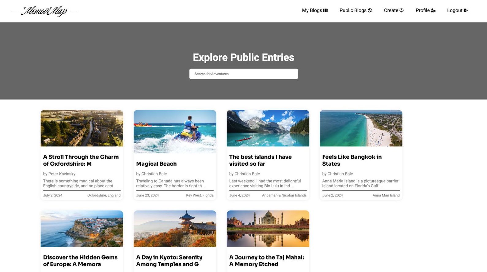

# MemoirMap

MemoirMap is a travel journal application designed to help users document their adventures, family vacations, and personal trips. Users can create diaries, upload photos, and choose to share their experiences publicly or keep them private.

<div style="display: flex; justify-content: center; gap: 10px;">
  
  
  
</div>
<p align="center">
  <i>Screenshots of the homepage, my blogs page, and public blogs page</i>
</p>


## Features

- **Custom Travel Journals**: Craft personalized entries for each trip or experience.
- **Image Uploads**: Attach photos to enrich your travel logs.
- **Privacy Controls**: Opt to keep journals private or share them with the community.
- **Explore Experiences**: Browse through public entries created by other users to discover new destinations.
- **User-Friendly Interface**: A clean, intuitive UI built using modular CSS.
- **Security First**: MemoirMap secures user data by using HTTP-only cookies to store JSON Web Tokens (JWT), protecting against XSS vulnerabilities by restricting access through client-side JavaScript.

## Tech Stack

- **Frontend**: React.js
- **Backend**: Node.js, Express.js
- **Database**: MongoDB
- **Styling**: Modular CSS

## Installation

To run MemoirMap locally, follow the steps below:

### Prerequisites

- Ensure Node.js and npm are installed.
- Set up a MongoDB Atlas account and cluster.

### Setup

1. Clone the repository:

   ```bash
   git clone https://github.com/yourusername/MemoirMap.git
   cd MemoirMap
   ```

2. Install backend dependencies:

   ```bash
   cd server
   npm install
   ```

3. In the `server` directory, create a `.env` file and add the following:

   ```env
   PORT=5500
   MONGODB_URI=<your_mongodb_uri>
   JWT_SECRET=<your_jwt_secret>
   ```

4. In the `client` directory, create a `.env` file with:

   ```env
   REACT_APP_SERVER_BASE_URL=http://localhost:5500/api
   REACT_APP_CLOUDINARY_AUTH_URL=https://api.cloudinary.com/v1_1/<cloud_name>
   ```

5. Install frontend dependencies:

   ```bash
   cd client
   npm install
   ```

### Running the Application

1. Launch the backend server:

   ```bash
   cd server
   npm start
   ```

2. Start the frontend development server:

   ```bash
   cd client
   npm start
   ```

3. Access the app by visiting `http://localhost:3000` in your web browser.
